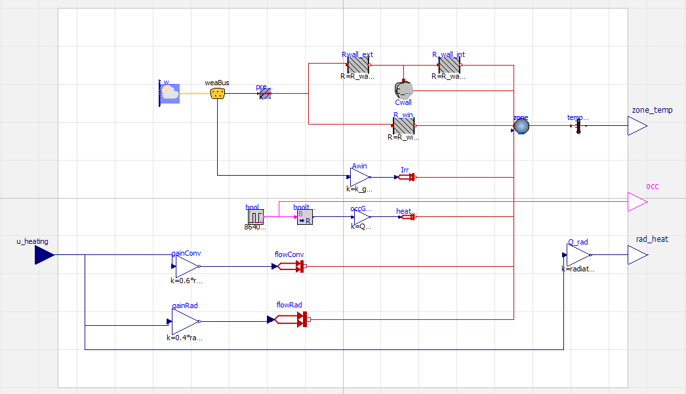

# DRL Controller on FMU environment

This project demonstrates the implementation of a Deep Reinforcement Learning (DRL) agent designed to control the heating system of a residential building. The agent interacts with a physics-based model of the house exported as a **Functional Mock-up Unit** (FMU) from Modelica.

The goal is to train an autonomous controller that optimizes thermal comfort while minimizing energy costs, learning strategies such as pre-heating and responding to dynamic energy pricing.

## 🏠 Building model (FMU)

The simulation environment is based on a 2R1C (2-Resistor, 1-Capacitor) lumped parameter model created in Modelica using the Buildings library.

### Key Components

- **Thermal Envelope**: Heavy masonry walls (high thermal mass) with external insulation.

- **Glazing**: Double-glazed windows with solar heat gain calculation.

- **Heating System**: Idealized heat source split into two components:

    - _Convective_ (60%): Directly heats the indoor air.

    - _Radiative_ (40%): Heats the wall thermal mass.

- **Occupancy**: Dynamic schedule (08:00 - 18:00) simulating internal heat gains from people.

### Interface

| Type | Variable | Description | Unit | 
|------|----------|-------------|------|
| Input (Action) | u_heating | Heating signal (0.0 - 1.0) | - |
| Output (Obs)| zone_temp | Indoor Air Temperature | °C |
| Output (Obs) | rad_heat | Heating Power Output  | W  |
| Output (Obs) | occ  |  Occupancy Status (1=Present) | Boolean |



## 🧠 Control Problem & Algorithm

The problem is formulated as a Markov Decision Process (MDP) solved using the **Proximal Policy Optimization** (PPO) algorithm.

### Observation Space

The agent receives a normalized vector containing:

- **Physical States**: Current Indoor Temp, Outdoor Temp, Solar Irradiance.

- **Contextual Data**: Energy Price (Time-of-Use), Time until Occupancy Start/End.

- **Derived Features**: Delta T (Setpoint vs Indoor), Delta T (Outdoor vs Indoor).

- **History**: Lagged indoor temperatures ($t_{-1}, t_{-2}, t_{-3}$) to understand thermal inertia.

### Action Space

Single continuous control variable $[0, 1]$ for the heating system.

### Reward Function

The reward $R_t$ is a weighted sum of comfort penalty and economic cost:

$$R_t = - ( w_{comfort} \cdot P_{comfort} + w_{cost} \cdot C_{energy} )$$

- **Comfort Penalty** ($P_{comfort}$): Squared difference from the target band (19-21°C during occupancy, >15°C otherwise).

- **Energy Cost** ($C_{energy}$): Calculated as $\text{HeatingPower} \times \text{EnergyPrice}$.

### Energy Price Signal:

- High: 07:00 - 19:00 (0.13 €/kWh)

- Low: Nighttime (0.039 €/kWh)

### Neural Network Architecture

- **Algorithm**: Stable Baselines3 PPO (MlpPolicy)

- **Structure**: Custom fully connected network [128, 64, 16]

## 🛠️ Installation & Usage

This project uses Poetry for dependency management.

### 1. Prerequisites

- Python 3.10 or higher

- Poetry installed

### 2. Setup

- Clone the repository and install dependencies:

```bash
# Clone the repository
git clone [https://github.com/yourusername/drl-house-controller.git](https://github.com/yourusername/drl-house-controller.git)
cd drl-house-controller
```
```bash
# Install environment and dependencies
poetry install
```

### 3. Training

To train the PPO agent from scratch:

```bash
poetry run python src/train.py
```

- The script loads the FMU configuration from src/config.json.

- Saves the trained model to ppo_simplehouse_model.zip.

- Logs progress to the logs/ directory.

### 4. Deployment & Visualization

To run the trained agent on a 1-week simulation and generate performance plots:

```bash
poetry run python src/deploy.py
```

This generates deployment_results.png, showing temperature profiles, HVAC actions, and cost optimization.

